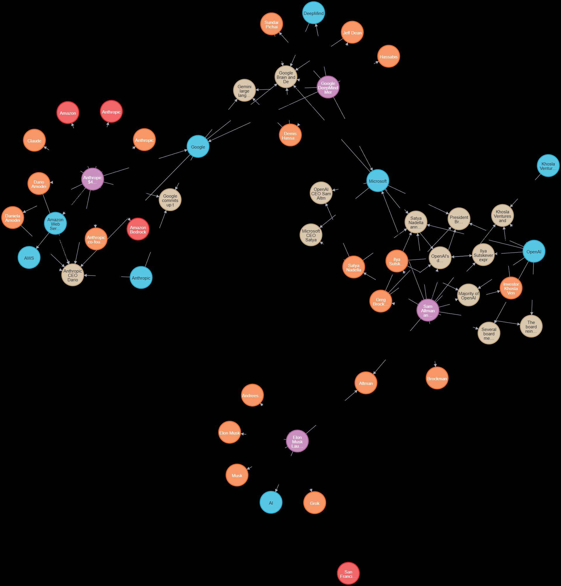

# Building a Local Knowledge Graph RAG System for News Analysis with Neo4j and Ollama

*How graph databases unlock multi-hop reasoning that vector databases simply can't do — built entirely for free, running entirely on your machine*

---

## The Problem with Traditional RAG

Imagine you ask your news analysis system: *"What is the connection between Elon Musk and Sam Altman?"*

A traditional RAG system backed by a vector database will search for the most semantically similar chunks and likely return one article — maybe the xAI launch, or maybe the OpenAI board crisis. But the full answer spans both, and more.

The complete picture is spread across multiple articles:

- Article 1: Musk and Altman co-founded OpenAI, Musk departed the board in 2018
- Article 2: Altman was fired and reinstated as CEO during the board crisis
- Article 3: Musk launched xAI and later sued OpenAI, alleging it had abandoned its non-profit mission

The connection is **multi-hop**, hidden in the relationships between documents. Vector similarity finds *text that looks alike*. It doesn't find *entities that are connected across time and events*.

This is the fundamental ceiling of flat vector search: every chunk is an island.

**Graph RAG removes that ceiling.** By storing not just content but the relationships between entities — people, organizations, locations, events — we can answer questions that require reasoning across multiple sources.

In this tutorial, we'll build **NewsGraphRAG** — a fully local, zero-cost system that:

- Extracts people, organizations, and events from news articles using spaCy and Ollama
- Stores them as a knowledge graph in Neo4j with a built-in vector index
- Answers multi-hop questions using hybrid graph traversal + semantic search
- Runs entirely on your machine — no API keys, no cloud costs, no rate limits

---

## Why Graph RAG? The Core Insight

Before we build, it's worth understanding exactly what changes when you add a graph layer.

In a standard RAG pipeline, you have:

```
Query → embedding → nearest chunks → LLM → answer
```

The retriever finds chunks that *look like* the query. That's it. There's no awareness of which entities appear in which chunks, or how those entities relate to each other.

In Graph RAG, the pipeline becomes:

```
Query → embedding → nearest chunks (vector)
      → entity extraction → graph traversal → connected context
      → combined context → LLM → answer
```

Now the retriever can follow relationships. "Musk" leads to events Musk was involved in. Those events lead to other people at the same events. Those people lead to their own events in other articles. The graph is the connective tissue between documents.

The key technical enabler is **Neo4j 5.x's built-in vector index**. You don't need a separate vector database alongside Neo4j — you get both graph traversal and semantic search in a single database, with Cypher as the unified query language for both.

---

## Architecture

```
┌─────────────────────────────────────────────────────┐
│                   News Articles                      │
└──────────────────────┬──────────────────────────────┘
                       │
           ┌───────────▼───────────┐
           │    NER Pipeline       │
           │  spaCy (fast pass)    │
           │  + Ollama (events)    │
           └───────────┬───────────┘
                       │
          ┌────────────▼────────────┐
          │     Neo4j Graph DB      │
          │                         │
          │  (Article)              │
          │     ├─MENTIONS_PERSON──▶(Person)
          │     ├─MENTIONS_ORG─────▶(Organization)
          │     ├─MENTIONS_LOCATION▶(Location)
          │     └─CONTAINS_EVENT───▶(Event)
          │                    ▲        ▲
          │         INVOLVED_IN│        │INVOLVED_IN
          │               (Person)  (Organization)
          │                         │
          │  [Vector Index on       │
          │   Article.embedding]────┘
          └────────────┬────────────┘
                       │
          ┌────────────▼────────────┐
          │    Hybrid Retriever     │
          │  vector search          │
          │  + graph traversal      │
          │  + multi-hop search     │
          └────────────┬────────────┘
                       │
          ┌────────────▼────────────┐
          │    Ollama LLM           │
          │    (llama3.2)           │
          │    enriched context     │
          └────────────┬────────────┘
                       │
                    Answer
```

### Vector DB vs Neo4j — choosing the right tool

| | Vector DB (Qdrant / Pinecone) | Neo4j |
|---|---|---|
| Data model | Flat vectors + metadata | Nodes + relationships + vectors |
| Core query | Nearest neighbor (ANN) | Graph traversal + ANN |
| Strength | Semantic similarity, speed | Multi-hop reasoning, relationships |
| Weakness | No relationship awareness | Slower for pure similarity at scale |
| RAG quality | Isolated chunks | Chunks + relationship paths |
| Best for | Document QA, simple chatbots | Entity networks, knowledge graphs |
| Setup | Low — managed services available | Medium — schema design required |

The short version: use a vector database when you need to find *similar text*. Use Neo4j when you need to find *connected entities*.

---

## Tech Stack

| Layer | Tool | Reason |
|---|---|---|
| LLM | Ollama / llama3.2 | Fully local, free, 4.7GB |
| Embeddings | Ollama / nomic-embed-text | 768-dim, fast, 274MB |
| NER | spaCy + Ollama | spaCy for speed, LLM for event structure |
| Graph DB | Neo4j 5.15 (Docker) | Built-in vector index, Cypher |
| HTTP client | httpx | Ollama API calls |
| Env management | python-dotenv | Config separation |

Everything runs locally. The only outbound network call is `docker pull` on first run.

---

## Step 1: Environment Setup

### Neo4j via Docker Compose

Create `docker-compose.yml` in your project root:

```yaml
services:
  neo4j:
    image: neo4j:5.15
    container_name: newsgraphrag-neo4j
    ports:
      - "7474:7474"   # Neo4j Browser (UI)
      - "7687:7687"   # Bolt protocol (app connection)
    environment:
      - NEO4J_AUTH=neo4j/newsgraphrag123  # Change this password
      - NEO4J_PLUGINS=["apoc"]
      - NEO4J_dbms_security_procedures_unrestricted=apoc.*
    volumes:
      - neo4j_data:/data
      - neo4j_logs:/logs
    healthcheck:
      test: ["CMD", "neo4j", "status"]
      interval: 10s
      timeout: 5s
      retries: 5

volumes:
  neo4j_data:
  neo4j_logs:
```

```bash
docker compose up -d
```

Open `http://localhost:7474` — username `neo4j`, password `newsgraphrag123`. You should see the Neo4j Browser.

### Ollama

```bash
# Linux/Mac
curl -fsSL https://ollama.com/install.sh | sh

# Windows — download from https://ollama.com/download

# Pull models (one-time download)
ollama pull llama3.2          # 4.7GB — the LLM
ollama pull nomic-embed-text  # 274MB — embeddings

# Verify
ollama run llama3.2 "Hello, are you working?"
```

### Python Environment

```bash
# Using conda (recommended to avoid DLL conflicts on Windows)
conda create -n newsgraphrag python=3.11 -y
conda activate newsgraphrag

pip install -r requirements.txt
python -m spacy download xx_ent_wiki_sm   # multilingual NER
```

`requirements.txt`:

```
# requirements.txt
neo4j==5.26.0
spacy==3.7.6
python-dotenv==1.0.1
httpx==0.27.2
```

### Project structure

```
newsgraphrag/
├── docker-compose.yml
├── requirements.txt
├── .env
├── src/
│   ├── __init__.py
│   ├── graph/
│   │   ├── __init__.py
│   │   ├── neo4j_client.py
│   │   ├── schema.py
│   │   └── graph_writer.py
│   ├── ingestion/
│   │   ├── __init__.py
│   │   ├── ner_extractor.py
│   │   └── pipeline.py
│   └── rag/
│       ├── __init__.py
│       ├── embedder.py
│       ├── retriever.py
│       └── chain.py
└── data/
    └── sample_news/
        └── news.json
```

`.env`:

```
NEO4J_URI=bolt://localhost:7687
NEO4J_USER=neo4j
NEO4J_PASSWORD=newsgraphrag123  # Change this before deploying
OLLAMA_BASE_URL=http://localhost:11434
LLM_MODEL=llama3.2
EMBED_MODEL=nomic-embed-text
```

---

## Step 2: Graph Schema Design

The schema is the most consequential design decision. A good schema makes queries elegant; a bad one makes them impossible.

We model news with five node types connected by six relationship types:

```
(Article)-[:MENTIONS_PERSON]──▶(Person)
(Article)-[:MENTIONS_ORG]─────▶(Organization)
(Article)-[:MENTIONS_LOCATION]▶(Location)
(Article)-[:CONTAINS_EVENT]───▶(Event)
(Person)──[:INVOLVED_IN]──────▶(Event)
(Organization)─[:INVOLVED_IN]─▶(Event)
```

Why model events as separate nodes rather than just properties on articles? Because events are the *joiners* — they're what lets us ask "who else was at this meeting?" by traversing `INVOLVED_IN` in both directions. Without event nodes, all we have is a bipartite person-article graph. With event nodes, we get a three-way structure that enables multi-hop queries.

`src/graph/schema.py`:

```python
from src.graph.neo4j_client import Neo4jClient

SCHEMA_QUERIES = [
    "CREATE CONSTRAINT IF NOT EXISTS FOR (a:Article) REQUIRE a.id IS UNIQUE",
    "CREATE CONSTRAINT IF NOT EXISTS FOR (p:Person) REQUIRE p.name IS UNIQUE",
    "CREATE CONSTRAINT IF NOT EXISTS FOR (o:Organization) REQUIRE o.name IS UNIQUE",
    "CREATE CONSTRAINT IF NOT EXISTS FOR (l:Location) REQUIRE l.name IS UNIQUE",
    "CREATE CONSTRAINT IF NOT EXISTS FOR (e:Event) REQUIRE e.id IS UNIQUE",
    """
    CREATE VECTOR INDEX article_embeddings IF NOT EXISTS
    FOR (a:Article) ON (a.embedding)
    OPTIONS {indexConfig: {
        `vector.dimensions`: 768,
        `vector.similarity_function`: 'cosine'
    }}
    """,
]

def setup_schema():
    client = Neo4jClient()
    for query in SCHEMA_QUERIES:
        client.run_query(query)
        print(f"✓ {query.strip()[:60]}...")
    client.close()
    print("Schema ready.")

if __name__ == "__main__":
    setup_schema()
```

```bash
python -m src.graph.schema
```

---

## Step 3: NER Pipeline — Extracting Entities and Events

Entity and event extraction is the most critical — and most fragile — step. We use a two-stage approach that combines speed with accuracy.

**Stage 1: spaCy** runs in milliseconds and handles basic named entity recognition — it finds person names, organizations, and locations in the text.

**Stage 2: Ollama** receives the pre-extracted entities and structures them into events with relationships. Giving the LLM a head start dramatically improves JSON reliability.

`src/ingestion/ner_extractor.py`:

```python
import spacy
import httpx
import json
import os
from dotenv import load_dotenv

load_dotenv()

nlp = spacy.load("xx_ent_wiki_sm")
OLLAMA_URL = os.getenv("OLLAMA_BASE_URL", "http://localhost:11434")
LLM_MODEL  = os.getenv("LLM_MODEL", "llama3.2")


def extract_with_spacy(text: str) -> dict:
    doc = nlp(text)
    entities = {"persons": [], "organizations": [], "locations": [], "misc": []}
    for ent in doc.ents:
        if ent.label_ in ("PER", "PERSON"):
            entities["persons"].append(ent.text.strip())
        elif ent.label_ == "ORG":
            entities["organizations"].append(ent.text.strip())
        elif ent.label_ in ("LOC", "GPE"):
            entities["locations"].append(ent.text.strip())
        else:
            entities["misc"].append(ent.text.strip())
    for k in entities:
        entities[k] = list(set(entities[k]))
    return entities


def extract_events_with_llm(text: str, entities: dict) -> list[dict]:
    prompt = f"""Analyze this news text and extract events in JSON format.

Text:
{text[:1500]}

Detected entities:
- Persons: {', '.join(entities['persons'])}
- Organizations: {', '.join(entities['organizations'])}
- Locations: {', '.join(entities['locations'])}

Return ONLY a JSON array (no wrapper, no explanation):
[
  {{
    "event": "short event summary",
    "persons": ["involved persons"],
    "organizations": ["related organizations"],
    "location": "event location or null",
    "date": "date if mentioned or null",
    "relation": "person-event relation (e.g. announced, attended, accused)"
  }}
]"""

    response = httpx.post(
        f"{OLLAMA_URL}/api/generate",
        json={
            "model": LLM_MODEL,
            "prompt": prompt,
            "stream": False,
            "options": {"num_predict": 2048, "temperature": 0.1}
        },
        timeout=120.0
    )
    raw = response.json()["response"].strip()

    try:
        if "```" in raw:
            raw = raw.split("```")[1]
            if raw.startswith("json"):
                raw = raw[4:]
            raw = raw.strip()

        parsed = None
        try:
            parsed = json.loads(raw)
        except json.JSONDecodeError:
            # Robust fallback: extract complete JSON objects from truncated output
            # This handles cases where llama3.2 cuts off mid-object on non-Latin chars
            events = []
            depth, start = 0, None
            for i, ch in enumerate(raw):
                if ch == '{':
                    if depth == 0:
                        start = i
                    depth += 1
                elif ch == '}':
                    depth -= 1
                    if depth == 0 and start is not None:
                        try:
                            events.append(json.loads(raw[start:i+1]))
                        except json.JSONDecodeError:
                            pass
            if events:
                print(f"  ⚠ Truncated JSON recovered: {len(events)} events")
                return events
            print(f"JSON parse failed:\n{raw}")
            return []

        if isinstance(parsed, dict):
            for key in ("events", "results", "data"):
                if key in parsed and isinstance(parsed[key], list):
                    return parsed[key]
            return []

        return parsed if isinstance(parsed, list) else []

    except Exception as e:
        print(f"Parse error: {e}")
        return []


def extract_all(text: str) -> dict:
    print("  → spaCy entity extraction...")
    entities = extract_with_spacy(text)
    print("  → Ollama event extraction...")
    events = extract_events_with_llm(text, entities)
    return {"entities": entities, "events": events}
```

**A note on the truncation fallback.** llama3.2 occasionally cuts JSON output mid-object, particularly on multi-byte UTF-8 characters which can land exactly on a token boundary. Rather than losing the entire response, the fallback parser extracts each complete `{...}` block individually. In practice this recovers 2 of 3 events when truncation occurs.

---

## Step 4: Writing to the Knowledge Graph

`src/graph/graph_writer.py`:

```python
from src.graph.neo4j_client import Neo4jClient
from datetime import datetime
import hashlib


def generate_id(text: str) -> str:
    return hashlib.md5(text.encode()).hexdigest()[:12]


class GraphWriter:
    def __init__(self):
        self.client = Neo4jClient()

    def write_article(self, article_id, title, text, url=""):
        self.client.run_query("""
            MERGE (a:Article {id: $id})
            SET a.title = $title, a.text = $text,
                a.url = $url, a.created_at = $created_at
        """, {"id": article_id, "title": title, "text": text,
              "url": url, "created_at": datetime.now().isoformat()})

    def write_entities(self, article_id, entities):
        for person in entities.get("persons", []):
            self.client.run_query("""
                MERGE (p:Person {name: $name})
                WITH p
                MATCH (a:Article {id: $article_id})
                MERGE (a)-[:MENTIONS_PERSON]->(p)
            """, {"name": person, "article_id": article_id})

        for org in entities.get("organizations", []):
            self.client.run_query("""
                MERGE (o:Organization {name: $name})
                WITH o
                MATCH (a:Article {id: $article_id})
                MERGE (a)-[:MENTIONS_ORG]->(o)
            """, {"name": org, "article_id": article_id})

        for loc in entities.get("locations", []):
            self.client.run_query("""
                MERGE (l:Location {name: $name})
                WITH l
                MATCH (a:Article {id: $article_id})
                MERGE (a)-[:MENTIONS_LOCATION]->(l)
            """, {"name": loc, "article_id": article_id})

    def write_events(self, article_id, events):
        for event in events:
            event_id = generate_id(event["event"])
            self.client.run_query("""
                MERGE (e:Event {id: $id})
                SET e.description = $description,
                    e.location = $location,
                    e.date = $date,
                    e.relation = $relation
                WITH e
                MATCH (a:Article {id: $article_id})
                MERGE (a)-[:CONTAINS_EVENT]->(e)
            """, {"id": event_id, "description": event["event"],
                  "location": event.get("location", ""),
                  "date": event.get("date", ""),
                  "relation": event.get("relation", ""),
                  "article_id": article_id})

            for person in event.get("persons", []):
                self.client.run_query("""
                    MERGE (p:Person {name: $name})
                    WITH p
                    MATCH (e:Event {id: $event_id})
                    MERGE (p)-[:INVOLVED_IN {relation: $relation}]->(e)
                """, {"name": person, "event_id": event_id,
                      "relation": event.get("relation", "")})

            for org in event.get("organizations", []):
                self.client.run_query("""
                    MERGE (o:Organization {name: $name})
                    WITH o
                    MATCH (e:Event {id: $event_id})
                    MERGE (o)-[:INVOLVED_IN]->(e)
                """, {"name": org, "event_id": event_id})

    def close(self):
        self.client.close()
```

**Why `MERGE` instead of `CREATE`?** `MERGE` is idempotent — if a node with those properties already exists, Neo4j finds it rather than creating a duplicate. This means the ingestion pipeline is safe to re-run on the same articles, and it naturally handles the same person appearing across multiple articles without creating separate nodes.

After ingesting 15 articles, the knowledge graph looks like this:



*The knowledge graph after ingesting 15 AI industry news articles. Sam Altman emerges as the most connected node, appearing across the board crisis, GPT-4o launch, Senate hearing, and Stargate announcement. Note duplicate nodes for the same entity under different surface forms — a real-world reminder that entity disambiguation is a critical next step for production systems.*

You can reproduce this in Neo4j Browser at `http://localhost:7474`:

```cypher
MATCH (n) RETURN n LIMIT 50
```
After writing entities and events, each article is embedded using nomic-embed-text via Ollama and stored directly on the Article node. This embedding is what powers the vector search side of hybrid retrieval — the same Neo4j node holds both the graph relationships and its vector representation, eliminating the need for a separate vector store.

---

## Step 5: Hybrid Retrieval — Graph + Vector

For every query, we run three searches and combine the results.

`src/rag/retriever.py`:

```python
from src.graph.neo4j_client import Neo4jClient
from src.rag.embedder import get_embedding


class HybridRetriever:
    def __init__(self):
        self.client = Neo4jClient()

    def vector_search(self, query: str, top_k: int = 3) -> list[dict]:
        """Find articles by semantic similarity."""
        query_embedding = get_embedding(query)
        return self.client.run_query("""
            CALL db.index.vector.queryNodes(
                'article_embeddings', $top_k, $embedding
            )
            YIELD node, score
            RETURN node.id AS id, node.title AS title,
                   node.text AS text, score
            ORDER BY score DESC
        """, {"top_k": top_k, "embedding": query_embedding})

    def graph_search(self, person_name: str) -> list[dict]:
        """Find events involving a person, with co-participants."""
        return self.client.run_query("""
            MATCH (p:Person)-[:INVOLVED_IN]->(e:Event)
            WHERE toLower(p.name) CONTAINS toLower($name)
            OPTIONAL MATCH (other:Person)-[:INVOLVED_IN]->(e)
            WHERE other.name <> p.name
            RETURN p.name AS person,
                   e.description AS event,
                   e.relation AS relation,
                   collect(DISTINCT other.name) AS other_persons
        """, {"name": person_name})

    def multi_hop_search(self, person_name: str) -> list[dict]:
        """Find people connected to person X through shared events."""
        return self.client.run_query("""
            MATCH (p:Person)-[:INVOLVED_IN]->(e:Event)<-[:INVOLVED_IN]-(other:Person)
            WHERE toLower(p.name) CONTAINS toLower($name)
            AND other.name <> p.name
            RETURN p.name AS source_person,
                   other.name AS connected_person,
                   e.description AS via_event,
                   count(e) AS shared_events
            ORDER BY shared_events DESC
        """, {"name": person_name})

    def hybrid_search(self, query: str, person_hint: str = "") -> dict:
        vector_results = self.vector_search(query, top_k=3)
        graph_results = []
        multi_hop = []
        if person_hint:
            graph_results = self.graph_search(person_hint)
            multi_hop = self.multi_hop_search(person_hint)
        return {
            "vector_results": vector_results,
            "graph_results": graph_results,
            "multi_hop": multi_hop
        }
```

The multi-hop query is the key differentiator. It answers: *"Who else is connected to Person X, and through which events?"*

```cypher
MATCH (p:Person)-[:INVOLVED_IN]->(e:Event)<-[:INVOLVED_IN]-(other:Person)
WHERE toLower(p.name) CONTAINS toLower($name)
AND other.name <> p.name
RETURN p.name, other.name, e.description, count(e) AS shared_events
```

This traverses two relationship edges — `Person → Event ← Person` — in a single query. No vector database supports this natively.

---

## Step 6: The QA Chain

`src/rag/chain.py` combines all three retrieval results into a single context string and passes it to the LLM:

```python
def build_context(retrieval_result: dict) -> str:
    parts = []

    if retrieval_result["vector_results"]:
        parts.append("=== RELATED ARTICLES ===")
        for r in retrieval_result["vector_results"]:
            parts.append(f"Title: {r.get('title', '')}")
            parts.append(f"Content: {r.get('text', '').strip()}\n")

    if retrieval_result["graph_results"]:
        parts.append("=== EVENT GRAPH ===")
        for r in retrieval_result["graph_results"]:
            other = ", ".join(r["other_persons"]) if r["other_persons"] else "—"
            parts.append(f"• Event: {r['event']}")
            parts.append(f"  Other participants: {other}\n")

    if retrieval_result["multi_hop"]:
        parts.append("=== PERSON CONNECTIONS ===")
        seen = set()
        for r in retrieval_result["multi_hop"]:
            key = tuple(sorted([r["source_person"], r["connected_person"]]))
            if key not in seen:
                seen.add(key)
                parts.append(
                    f"• {r['source_person']} ↔ {r['connected_person']} "
                    f"(via: {r['via_event'][:60]})"
                )

    return "\n".join(parts)


def ask(question: str, person_hint: str = "") -> str:
    retriever = HybridRetriever()
    retrieval_result = retriever.hybrid_search(question, person_hint)
    retriever.close()

    context = build_context(retrieval_result)
    if not context.strip():
        return "Insufficient information in the knowledge base for this query."

    prompt = f"""You are a news analysis assistant.
Answer the question using only the information below.
Do not speculate. Respond only in English.

{context}

QUESTION: {question}

ANSWER:"""

    response = httpx.post(
        f"{OLLAMA_URL}/api/generate",
        json={
            "model": LLM_MODEL,
            "prompt": prompt,
            "stream": False,
            "options": {"num_predict": 512, "temperature": 0.2}
        },
        timeout=120.0
    )
    return response.json()["response"].strip()
```

---

## Results: Real System Output

Here are actual outputs from the system after ingesting 15 AI industry news articles. None of these answers exist in a single document.

The knowledge graph after ingesting 15 articles:


*Sam Altman emerges as the most connected node — appearing in the board crisis, GPT-4o launch, Senate hearing, and Stargate announcement. Microsoft bridges the OpenAI and Nvidia clusters. Anthropic sits in its own cluster connected via the Amazon AWS deal.*

---

**Query:** *"What is the connection between Elon Musk and Sam Altman?"*

```
Elon Musk and Sam Altman were previously co-founders of OpenAI, but Musk 
departed from its board in 2018 due to disagreements over the company's 
direction. He later sued OpenAI and Sam Altman, alleging that the company 
had abandoned its original non-profit mission.
```

The system traversed two separate articles — the xAI/Grok launch (which described Musk's OpenAI history) and the board crisis article (which described Altman's reinstatement) — and synthesized the relationship across both. Neither article tells the complete story alone.

**Query:** *"Who did Satya Nadella appear with at AI events?"*

```
Satya Nadella appeared with the following individuals at AI events:
1. Sam Altman
2. Jensen Huang
3. Sundar Pichai
4. Mira Murati
5. Greg Brockman
```

Five different people across four different articles — the OpenAI board crisis, the Copilot launch, the Nvidia GTC keynote, and the GPT-4o announcement. A vector search on "Satya Nadella AI events" would return at most one or two articles. The graph traversal found every co-occurrence.

**Query:** *"Which AI CEOs testified at the US Senate hearing?"*

```
Sam Altman and Dario Amodei testified at the US Senate hearing 
on artificial intelligence regulation.
```

Clean, precise, single-article retrieval. Vector search handles this well too — it's a good baseline comparison showing that Graph RAG doesn't hurt simple queries while dramatically improving complex ones.

---

The pattern is clear: **simple queries work the same as vector search. Complex multi-entity queries are where the graph pays off.**

---

## When to Use Microsoft GraphRAG vs Entity Graph RAG

Microsoft Research introduced GraphRAG in 2024 with a different architectural focus. While NewsGraphRAG uses explicit entity extraction and performs multi-hop traversal over explicit entity-event edges, Microsoft GraphRAG builds an LLM-derived knowledge graph and clusters it into hierarchical communities with pre-generated summaries.

Importantly, Microsoft's own paper distinguishes between two retrieval modes: **global search**, which reasons over community summaries to answer corpus-wide questions, and **local search**, which retrieves from entity-level context. NewsGraphRAG operates closest to the local search pattern — but with explicit, inspectable graph edges rather than LLM-derived ones.

The two systems optimize for different retrieval patterns:

- **Microsoft GraphRAG** is especially strong for corpus-level sensemaking — *"What are the main themes across all documents?"* It builds community summaries across the entire corpus and answers holistically via global search.
- **Entity-centric graph RAG** (this system) is stronger for explicit multi-hop relationship queries — *"Who is connected to whom, through which events?"* It performs traversal over explicit entity-event edges and can show you the exact path.

In practice, the approaches are complementary rather than mutually exclusive.

There are two additional practical considerations worth knowing:

**Cost.** In practice, Microsoft GraphRAG indexing often involves many LLM calls for entity extraction, clustering, and community summarization, which can become expensive when using hosted frontier models like GPT-4. The system can be configured with local models, but the call volume remains high. NewsGraphRAG uses Ollama for all inference — the marginal cost of adding a new article is zero.

**Provenance tracking.** Microsoft GraphRAG answers emerge from pre-aggregated community summaries, which makes attribution less explicit — it becomes harder to trace which source document contributed which fact. In NewsGraphRAG, every answer can be traced back to specific `INVOLVED_IN` edges and their source articles directly in Neo4j Browser. For journalism, legal research, or any audit-requiring application, this provenance tracking is a meaningful architectural advantage.

Neither system is universally better. The right choice depends on your query pattern:

- Thematic and holistic → Microsoft GraphRAG (global search)
- Relational and traceable → Entity graph RAG (explicit edge traversal)

---

## Known Limitations

No system is perfect. These are the failure modes to understand before deploying in production.

**Entity disambiguation.** spaCy may recognize "Sam Altman" and "OpenAI CEO Sam Altman" as separate entities, creating duplicate nodes for the same person. A production system needs a fuzzy matching or embedding-based disambiguation step before writing to Neo4j.

**Cross-article hallucination.** When the LLM receives context from three different articles simultaneously, it can occasionally blend facts — attributing a statement from one event to a different one. Always validate critical multi-hop answers against source articles.

**Local LLM JSON reliability.** llama3.2 occasionally truncates JSON output mid-object, particularly on multi-byte UTF-8 characters which can land exactly on a token boundary. We handle this with a robust fallback parser, but some events are still lost. A structured output API (when it becomes available for local models) would eliminate this entirely.

**NER recall on informal references.** spaCy's multilingual model (`xx_ent_wiki_sm`) catches prominent proper nouns but misses informal references like "the minister", "the president", "the Kremlin spokesperson". Depending on your corpus, a fine-tuned NER model could significantly increase recall.

**Graph correctness depends on extraction quality.** Garbage in, garbage out. The graph is only as good as the NER pipeline that feeds it. Errors in entity extraction compound across multiple articles — a misidentified person creates false connections that look authoritative.

---

## Key Design Decisions

**Why two-stage NER instead of just Ollama?** spaCy runs in ~50ms. A pure LLM approach would take 10–30 seconds per article. More importantly, giving the LLM a pre-extracted entity list reduces its task from "find and structure everything" to "find relationships between these known entities" — a significantly easier task that produces more reliable JSON.

**Why `MERGE` instead of `CREATE`?** `MERGE` is idempotent. Re-running ingestion on the same corpus won't create duplicates. It also naturally handles the same person mentioned in multiple articles — they converge to a single node, which is exactly what you want for relationship traversal.

**Why 768 dimensions for the vector index?** `nomic-embed-text` produces 768-dimensional embeddings. This must match the index configuration exactly. If you switch embedding models, you need to drop and recreate the vector index and re-embed all articles.

**Why temperature 0.1 for event extraction?** Structured JSON output needs determinism. Higher temperature increases creativity and increases JSON parse errors. For a generation task (writing prose answers) we use 0.2 — slightly higher to avoid robotic repetition.

**Why embed the article title + text concatenated?** The title often contains information not repeated in the body — "Sam Altman Fired and Reinstated as OpenAI CEO" tells you the key actors and event before you read a single sentence. Including it in the embedding improves retrieval relevance for title-specific queries.

---

## What's Next

This system is a working foundation. Practical extensions in order of impact:

**Entity disambiguation** — implement fuzzy matching (e.g. using `rapidfuzz`) before the `MERGE` step. "Altman", "Sam Altman", "OpenAI CEO Sam Altman" should all resolve to the same node.

**Web scraper + RSS ingestion** — replace the static JSON file with a live feed. RSS → article text → pipeline → graph. The graph becomes a continuously updated news intelligence layer.

**Temporal graph** — add `date` as a first-class node type with `BEFORE`/`AFTER` relationships. This enables queries like *"What happened in the week before the summit?"*

**FastAPI interface** — wrap `ask()` in a REST endpoint. Three lines of FastAPI, and you have a queryable API for any frontend.

**Neo4j Bloom visualization** — Bloom is Neo4j's native graph exploration tool. Connect it to your local instance and you get an interactive, filterable view of the entire news graph.

---

## Conclusion

The central insight of Graph RAG is simple: documents don't exist in isolation, and neither do the entities within them. When you model the relationships between entities explicitly — not just the text that mentions them — you unlock a class of questions that flat vector search cannot answer.

Neo4j's built-in vector index makes the implementation pragmatic. You don't need to run and synchronize two separate databases. One database, one schema, one query language for both graph traversal and semantic search.

The entire system runs locally with Ollama. No API costs, no data leaving your machine, no rate limits. The only constraint is your hardware — and with llama3.2 running on CPU, that's a surprisingly low bar.

---

*Built with Neo4j 5.15, Ollama (llama3.2 + nomic-embed-text), spaCy xx_ent_wiki_sm, and httpx.*

*All outputs shown are real terminal results from the working system.*
